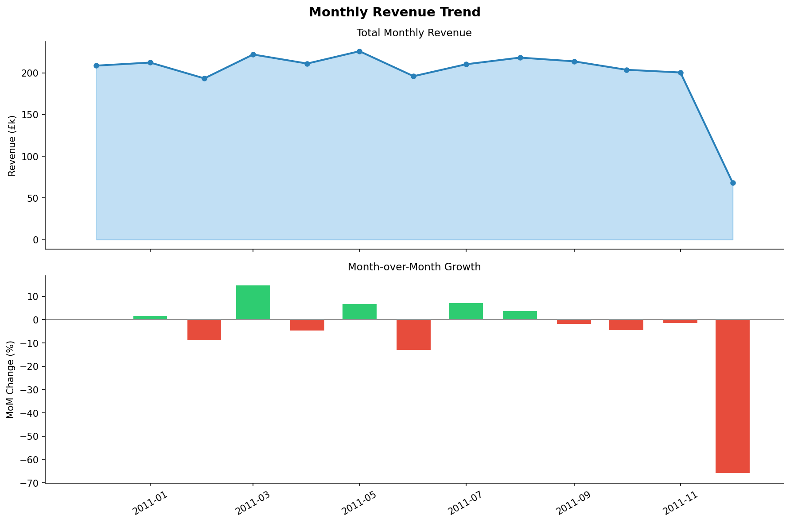
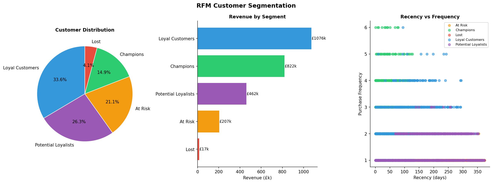
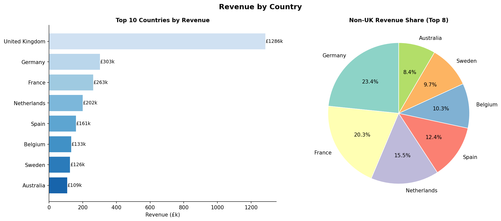
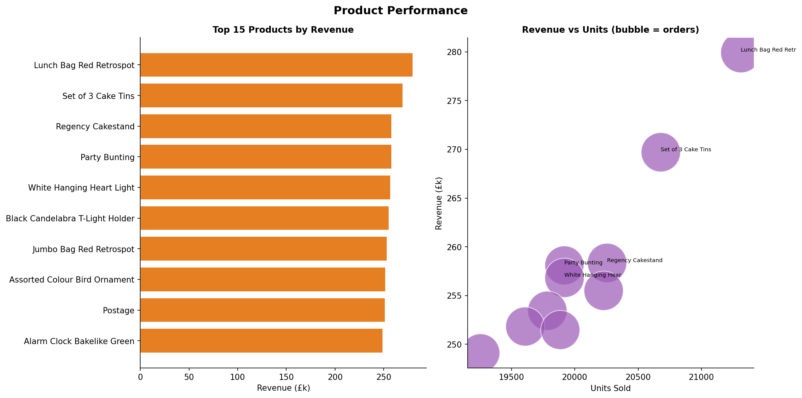
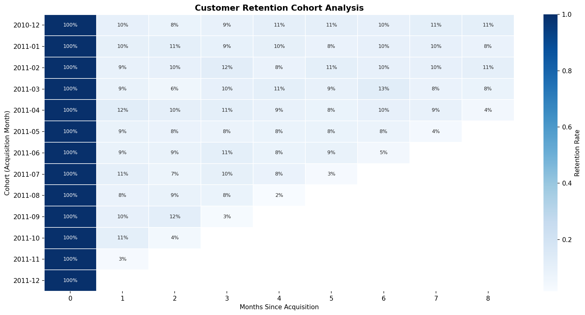

# Online Retail Analytics — RFM Segmentation & Cohort Analysis
[](https://python.org)
[](sql/)
[](https://archive.ics.uci.edu/dataset/352/online+retail)

## Business Problem

> *Which customers are most valuable, how do we segment them for targeted campaigns, and where is revenue growing or declining?*

This project applies RFM segmentation, cohort retention analysis, and SQL analytics to 541K UK e-commerce transactions (2010–2011). The pipeline identifies high-value customer segments, tracks monthly revenue trends, and surfaces which products and markets drive growth.

## Dataset

| Source | Details |
|--------|---------|
| [UCI Online Retail](https://archive.ics.uci.edu/dataset/352/online+retail) | 541K transactions, 4,372 customers, 2010–2011 |
| Synthetic fallback | `eda_pipeline.py` auto-generates data if dataset not present |

## Key Outputs











## Analysis Modules

| File | What it does |
|------|-------------|
| `eda_pipeline.py` | EDA + RFM segmentation + cohort retention + 5 output charts |
| `sql/retail_analysis.sql` | 6 SQL queries: revenue trend, RFM, products, repeat rate |

## SQL Queries Included

| Query | Technique | Business Question |
|-------|-----------|-------------------|
| Monthly revenue trend + MoM growth | `LAG()` window function | Is revenue growing? |
| RFM customer segmentation | `NTILE()` + CASE | Who are our best customers? |
| Product revenue performance | Aggregation + ranking | Which products drive revenue? |
| Country revenue breakdown | GROUP BY + proportion | Where are customers located? |
| Repeat purchase rate | CTE + conditional aggregation | How many customers return? |
| Revenue by customer segment | Partition-level proportion | What's the Champions segment worth? |

## Quickstart

```bash
git clone https://github.com/Shreya-Macherla/Online-Retail-Predictions
cd Online-Retail-Predictions
pip install -r requirements.txt
python eda_pipeline.py   # runs on synthetic data — no download needed
```

To use real UCI data, place `OnlineRetail.xlsx` in the repo root (free download, no login required).

## Repository Structure

```
Online-Retail-Predictions/
├── eda_pipeline.py               # Main EDA + RFM + cohort analysis pipeline
├── sql/
│   └── retail_analysis.sql       # 6 analytical SQL queries
├── outputs/
│   ├── 01_monthly_revenue.png
│   ├── 02_rfm_segmentation.png
│   ├── 03_country_revenue.png
│   ├── 04_product_performance.png
│   └── 05_cohort_retention.png
├── requirements.txt
└── README.md
```

## Tools

`Python 3.8` `Pandas` `Matplotlib` `Seaborn` `SQL (DuckDB)`
